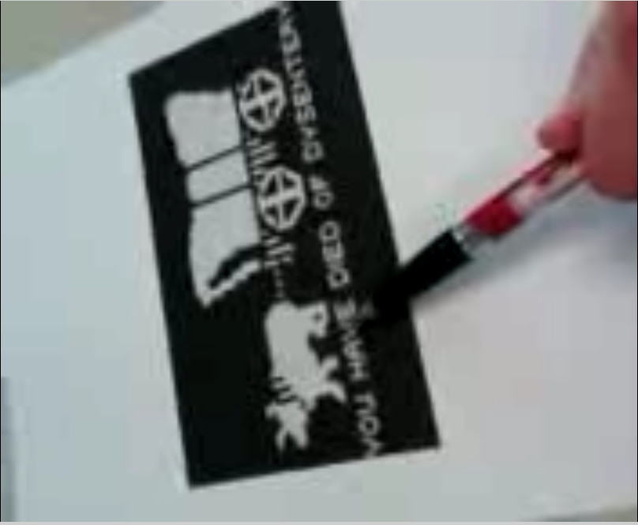
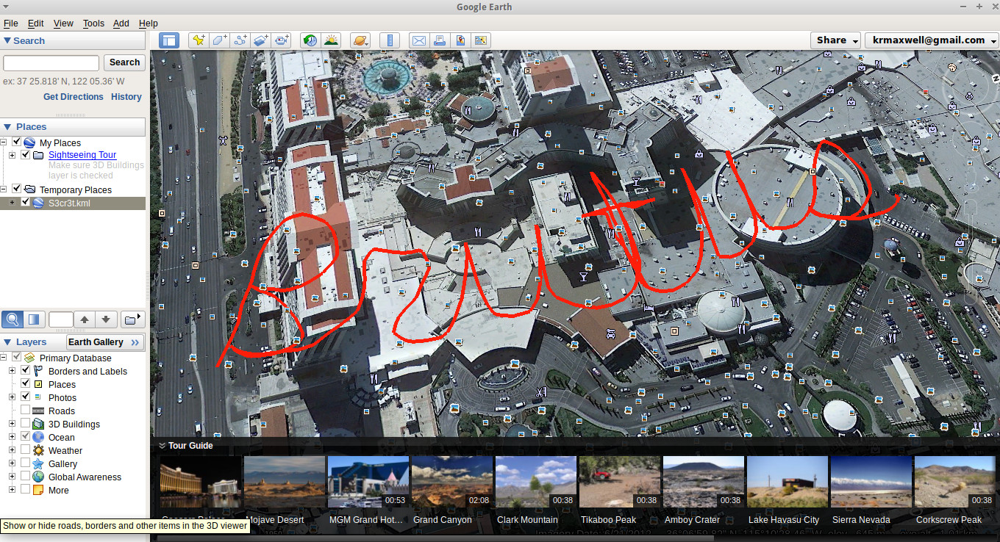
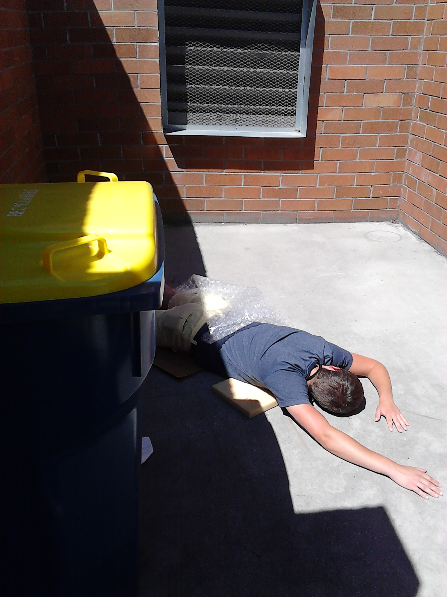

Title: Network Forensics Contest - DEF CON 2013
Date: 2013-08-14
Author: Kyle Maxwell
Summary: Network Forensics Contest writeup from DEF CON 2013

Introduction
============
To start the [contest](http://forensicscontest.com/2013/07/09/join-us-for-black-hat-and-defcon), we were given a CD containing a TrueCrypt volume and a few associated files, most notably the introduction to the contest:

> Introduction: Jack Stone has been retired from the Agency for nearly 7 years. After his retirement Jack found himself looking to bring some adventure back into his life. Jack got himself a private investigator license and opened his own firm. Rock Solid Investigations, LLC. has been solving interesting and complex cases for nearly 3 years. Jack's business has grown to include his former partner Timothy Jones and his newest hire, you, a professional forensic analyst. Together the staff at Rock Solid Investigations has over 50 years of investigative experience. Rock Solid is one of the most sought after PI companies in North America. However, all of their success and experience could not prepare them for what lay ahead. It was a usual Tuesday afternoon at Rock Solid. Jack was on the phone talking to potential clients, Tim was out on recon, and you were using e-discovery techniques to track down a runaway bride. Just then a strange woman walked in the front door. Jack finished his phone call and greeted the visitor. Victoria Jensen hired Rock Solid to determine whether or not her husband Gregory Jensen was cheating on her. Gregory was the CEO of Impressive Dynamics a company specializing in technology and weapons invention and manufacturing. Impressive Dynamics holds many DoD and other government contracts. This case would not be low profile. The firm has hired you as a forensic investigator to investigate the alleged affair. Can you solve the case?

The primary rule is: "There are eight contest rounds containing eight evidence files. You must analyze the evidence files in order to answer the question(s) which go along with each capture. The answers to those questions will be used to unlock the next round of the contest."

So at noon Friday, the contest released the password to the TrueCrypt file and we were off. Due to some logistical issues on our end, the DC214 team did not get started for over 24 hours. But once we did, we tore through it. Here's how.

Round 1
-------

Password: `SYN-SYNACK-ACK=STart!@#$&@ `

The TrueCrypt file contained a Round1 folder and seven more TrueCrypt volumes (Round[2-8].tc). Within Round1/ we found an HTML file and round1.pcap.

> Having accepted the Jensen case, Jack and his team install network taps and wireless capture devices in Mr. Jensen's business and home. During monitoring, Jack and his team discover an interesting suspect, Betty. This could be the woman Mrs. Jensen fears her husband is having an affair with. Jack assigns you the forensic analyst to look further into the information capture. You learn that a meeting has been setup. 
What day of the week is the meeting scheduled for? 

Pulling open the .pcap in Wireshark, we found lots of HTTP traffic, mostly around Google Images searches, that we found to be totally irrelevant with a few possible red herrings. But the first TCP stream consisted of an IRC chat:

```
PRIVMSG #S3cr3tSp0t :Hi Greg :)
:D34thM3rch4nt!~blah2@7FF07A37.29E7D414.B9027CEB.IP PRIVMSG #S3cr3tSp0t :Hi Betty
:D34thM3rch4nt!~blah2@7FF07A37.29E7D414.B9027CEB.IP PRIVMSG #S3cr3tSp0t :what day do you want to meet up?
PING :hades.de.eu.SwiftIRC.net
PONG :hades.de.eu.SwiftIRC.net
PING :hades.de.eu.SwiftIRC.net
PONG :hades.de.eu.SwiftIRC.net
PING :hades.de.eu.SwiftIRC.net
PONG :hades.de.eu.SwiftIRC.net
PRIVMSG #S3cr3tSp0t :&#x48;&#x6F;&#x77;&#x20;&#x64;&#x6F;&#x65;&#x73;&#x20;&#x57;&#x65;&#x64;&#x6E;&#x65;&#x73;&#x64;&#x61;&#x79;&#x20;&#x73;&#x6F;&#x75;&#x6E;&#x64;&#x3F;
:D34thM3rch4nt!~blah2@7FF07A37.29E7D414.B9027CEB.IP PRIVMSG #S3cr3tSp0t :&#x47;&#x72;&#x65;&#x61;&#x74;&#x20;&#x3A;&#x29;&#x20;&#x77;&#x68;&#x61;&#x74;&#x20;&#x74;&#x69;&#x6D;&#x65;&#x3F;
PRIVMSG #S3cr3tSp0t :&#x61;&#x68;&#x20;&#x32;&#x70;&#x6D;
:D34thM3rch4nt!~blah2@7FF07A37.29E7D414.B9027CEB.IP PRIVMSG #S3cr3tSp0t :&#x4F;&#x6B;&#x2C;&#x20;&#x49;&#x20;&#x63;&#x61;&#x6E;&#x27;&#x74;&#x20;&#x77;&#x61;&#x69;&#x74;&#x21;
```

So we have Greg as "D34thM3rch4nt" in a channel called #S3cr3tSp0t (nice 1337 speak). Much of the text is found in hex codes that look like ASCII characters to me. So I opened up Python in a terminal window and applied a bit of knowledge I've learned while working on the Matasano Crypto Challenges recently:

```python
>>> import re
s1=':&#x48;&#x6F;&#x77;&#x20;&#x64;&#x6F;&#x65;&#x73;&#x20;&#x57;&#x65;&#x64;&#x6E;&#x65;&#x73;&#x64;&#x61;&#x79;&#x20;&#x73;&#x6F;&#x75;&#x6E;&#x64;&#x3F;'
>>> re.sub("&#x","",re.sub("[:;]","",s1)).decode('hex')
'How does Wednesday sound?'
>>> s2=":&#x47;&#x72;&#x65;&#x61;&#x74;&#x20;&#x3A;&#x29;&#x20;&#x77;&#x68;&#x61;&#x74;&#x20;&#x74;&#x69;&#x6D;&#x65;&#x3F;"
>>> re.sub("&#x","",re.sub("[:;]","",s2)).decode('hex')
'Great :) what time?'
>>> s3=":&#x61;&#x68;&#x20;&#x32;&#x70;&#x6D;"
>>> re.sub("&#x","",re.sub("[:;]","",s3)).decode('hex')
'ah 2pm'
>>> s4=":&#x4F;&#x6B;&#x2C;&#x20;&#x49;&#x20;&#x63;&#x61;&#x6E;&#x27;&#x74;&#x20;&#x77;&#x61;&#x69;&#x74;&#x21;"
>>> re.sub("&#x","",re.sub("[:;]","",s4)).decode('hex')
"Ok, I can't wait!"
```

That's fairly straightforward. (And yes, there are other, perhaps easier, ways to do this - as we'll see in later rounds.) We texted the answer "Wednesday" to the contest and got the password to Round2.tc.

Round 2
-------

Password: `MTA567=@ `

> Betty attempts to keep her tracks covered as she establishes a meeting location with Gregory. 
What city are they meeting? 

The pcap contains a lot more Google Images related traffic, including a red herring where somebody looks at a map of Irvine, CA. That's not the right answer. However, once we eliminate a lot of the chaff (HTTP/HTTPS/DNS), we find another IRC chat:

```
PING :tripwire.uk.eu.SwiftIRC.net
PONG :tripwire.uk.eu.SwiftIRC.net
PING :tripwire.uk.eu.SwiftIRC.net
PONG :tripwire.uk.eu.SwiftIRC.net
NOTICE D34thM3rch4nt :DCC Send r3nd3zv0us (172.29.1.50)
PRIVMSG D34thM3rch4nt :.DCC SEND r3nd3zv0us 2887582002 1024 819200.
:tripwire.uk.eu.SwiftIRC.net NOTICE betty :Message to D34thM3rch4nt blocked: Please find another way to transfer your file
```

A file named "r3nd3zv0us" sure does look interesting and relevant. I believe I'd like to see what's in that file. TCP stream 138 contains the private send, and we can extract the 819200 bytes sent. The file doesn't appear to be of any known format, though, so we need to keep looking. Back to the HTTP traffic, since not much is left outside that filter. It looks like `mail.aol.com` is one of the hosts, though, when we look at the HTTP objects available for export. I see that some of the HTML files look like messages, so sure enough: 

```json
[{"isCertifiedMail":false,"inlineImgIds":[],"isVirusRepaired":false,"replyAllCcAddrs":"","isSuccess":true,"baseSubject":"Sorry","attachments":[],"folderType":"Inbox","hasLinksAndImages":false,"displayTo":"betty_swindoll <betty_swindoll@aol.com>","sentTime":"03-Jul-2013 12:02:57 +0000","isLikelyForward":false,"spamReason":"","displayBcc":"","receivedTime":1372867377000,"bcc":[],"hasImages":false,"isRead":true,"knownSender":true,"to":[{"shorterDisplayForm":"betty_swindoll","displayForm":"betty_swindoll <betty_swindoll@aol.com>","userInputForm":"betty_swindoll@aol.com"}],"isSeen":true,"isVoicemail":false,"isVirusScanned":false,"uid":"283","hasAttachments":false,"replyAllAddrs":"d34thm3rch4nt@aol.com","isSpam":false,"messageID":"<8D0461DEADD2C15-1010-74B6B@webmail-m255.sysops.aol.com>","hasFailedSpfCheck":false,"displayFrom":"Greg Jensen <d34thm3rch4nt@aol.com>","subject":"Re: Sorry","isFlagged":false,"replyToAddrs":"d34thm3rch4nt@aol.com","cc":[],"isDraft":false,"body":"<html>
```

There it is: **S3cr3tVV34p0n**. On a hunch, I attempted to mount the r3nd3zv0us file in TrueCrypt with that password, and it worked! The volume contains three files: a text note, a video file, and a JPEG. The text note just says "See You Soon! Betty" and I couldn't get the video file to play on my system. The JPEG file, though, contained an image of the famous "Welcome to Fabulous Las Vegas, Nevada" sign. 


Round 3
-------

Password: `spT6745@@&% `

> Gregory is hesitant to meet with the mysterious Betty. While working late in the office, Gregory hears his phone ring. He checks his phone and knows he has no choice but to attend the meeting with Betty. 
What will Gregory die from, if he fails to meet with Betty? 

Well this is a clue. What's on his phone? According to the HTTP object export, packet 390 starts a stream containing a file of around 140k bites from mmsc.cingular.com. Multimedia Messaging Service from Cingular (now AT&T Wireless) sounds very relevant to the prompt, so we look at the stream, which is a little complicated. Wireshark does a good job of decoding it, and it has a multipart body containing a small application/smil object and a larger video/mp4 object of 139505 bytes. In order to see this video, we have to carve out this particular object. Saving the HTTP object, we get a file of 140046 bytes that our media player can't read, since the header makes it look like a Synchronized Multimedia Integration Language file. We only want the last 139505 bytes. Unix provides the dd tool to do just this (read and write specific byte regions of a file), so we can run `dd if=mmsc.cingular.com of=video.mp4 bs=1 skip=541` to get the MP4 file that starts after 541 bytes.

Watching the file, we see a document titled "**TOP SECRET**" and hear a woman's voice threatening to release some files, then saying "remember who you're dealing with" as the camera pans to a printout of an Oregon Trail image that says "you have died of dysentery". Weird threat, but that's the answer: "dysentery".



Round 4
-------

Password: `MP42%!@ `

> Gregory, still unsure of Betty's true identity, meets with a group identifying themselves as Betty's Associates. They gave him a list of demands including numbers to bank accounts, and additional secret documents. Betty's Associates told Gregory he will be provided with information regarding the delivery of the goods. 
What is the password provided to Gregory? 

This turned out to be one of the more complicated rounds, largely due to simple user issues. First we noticed traffic between the user and mail.aol.com, so we looked at the messages and found something relevant:

> I'm so happy you made it. :) We should see a concert! How about Rod Stewart, the hits. Second Mezzanine, Section 4, Row H, Seat 410.You know the location and password for the drop. We should get dinner afterwards!

That gives us context but it's not actually the password - she's telling him he already knows it. That means we need to go back and see what else... wait, there's more to the message. It's all in escaped HTML, though, which is a pain to read, and there's a lot of it, unlike Round 1. I could never quite get it to format properly (at least not without more time than we wanted to spend), so one of my team mates working in parallel with a different toolset broke out NetworkMiner. That yielded a decently-formatted KML file for use in Google Earth. This took a bit of doing, as up until this point we were working on entirely air-gapped systems, being at DEF CON and all. However, if we wanted to finish, we needed to take some risks, so we installed the application and saved off the KML. Apparently we didn't get **all** the encodings right, so it took one tiny bit of manual cleanup, guided by error messages from Google Earth. That didn't take too long, and we had the word "Brutus" spelled in cursive right over the map of Caesar's Palace, Las Vegas. On to the next round.



Round 5
-------

Password: `C4M1121** `

> Gregory is missing! He was supposed to meet up with Betty and deliver the goods. After that, the trail quickly goes cold. A strange shipment has arrived to the offices of Rock Solid Investigations. Jack Stone opens the package and discovers a note and a cell phone. Jack immediately sends the cell phone to you, the forensic investigator. What happened to Gregory? 

Wait, what? This isn't network forensics, is it? But just like in real life, we don't always get to pick the sorts of evidence available. The data file this time did not consist of a PCAP but rather a file dump apparently from a Huawei Fusion 2 phone running Android. I don't know much about Android, that's going to be a pain. But let's open it up.

"This is Unix! I know this!"

Oh yeah, Android is Linux: not GNU/Linux, but Android/Linux. The directory "/HWUserData" looks like it's analogous to "/home", and when we poke around, we find a "DCIM" folder that contains a JPG of some dude laid out cold in an alley next to a trash can. Could this be Gregory? Where is it? In "/HWUserData/Android/data/com.cooliris.media/cache/", we find a number of images of his body, laid at different angles. The assailant (killer) posed his body a few different ways for the camera, playing with us. Sickos! We didn't find any geolocation data in the images, unfortunately, and this didn't look like enough to answer the question. We found lots of other data about the contest (like the email addresses they appeared to use), but it clearly didn't fit the storyline. Finally in "/data/data/com.android.browser/cache/webviewCache/6835a5ae" we found a JSON file that indicated he'd been checking the weather in Seattle, WA. The answer "Killed in Seattle" got us to the next round.



Round 6
-------

Password: `burt22$#@ `

> Mrs. Jensen decides to look further into this strange email. She decides to check her account balances to ensure she still has access to her accounts. How many bytes of data is the malicious payload? 

Malicious payloads sound much more like the network forensics to which we're accustomed. But this round is too easy for words. (After the last two, that's a welcome change.) The PCAP contains some HTTP and HTTPS traffic, and sure enough, there's only one interesting HTTP object, and that's a highly-obfuscated and suspicious Javascript file from paimia.com (not reproduced here because it really is live malware). According to [VirusTotal](https://www.virustotal.com/en/domain/paimia.com/information/), that's a very bad place with all sorts of exploits served.

We dithered a bit about whether they wanted the de-obfuscated payload, but the correct answer is literally the size of that script: 3113 bytes. Time to move on, we're getting close to the end of these eight volumes.

Round 7
-------

Password: `Haxxor*&% `

> Mrs. Jensen decides to look further into this strange email. She decides to check her account balances to ensure she still has access to her accounts. What is the URL of the false(Malicious) web page Victoria is directed to? 

This turned out to be one of the rounds I didn't like, for the sole reason that it wasn't a good answer. So when we look at the packets in Wireshark, we can see that she goes to bankofamerica.com, and in the middle of that she also hits bankofamerica.tt.omtrdc.net. Immediately thereafter, she searches Google for the phrase "why is my bank of america account not working?" So it turns out that that domain name is the right answer, but it isn't really: omtrdc.net is part of Omniture, which is a legitimate advertising network. I can't tell whether BofA does business with them, so it's possible she got some malicious ad, but in any case it's right and we move onto the final round.

Round 8
-------

Password: `FIN-ACK@@##$ `

> As Jack is wrapping up the case, he learns that the mystery is far from over. Who killed Gregory? 

The PCAP contains something really interesting this time: lots of VOIP traffic. Wireshark has functions specifically designed to handle this, so we select "Telephony > VoIP calls" and see two listed. Once we listen, we find out the deep, dark secret.

"Hi, this is Victoria? Hello Victoria, it's Jack Stone. I just wanted to call and give you an update about your case. Turns out, Gregory wasn't cheating on you at all. However, I do have some bad news about Sir Gregory. *background noise* Y-y-you killed him. I kinda think you might be wanted for murder. So, about that..."

And sure enough: Victoria his wife killed him. 

Lessons learned
---------------

In contest terms, we learned a few things for next year:

- Some contests don't really announce anything until 3-4 weeks before DEF CON. So don't think about it too much until July.
- Think about logistics: Have a designated "office" in somebody's hotel room, possibly a runner or other support person to go to contest area, and food & beverages on hand.
- Work in parallel: have team members working on different approaches using different tools at the same time.

In network forensics terms, I learned a lot about tools other than Wireshark and Python: NetworkMiner, Bro, chaosreader, other stuff in SecurityOnion.

